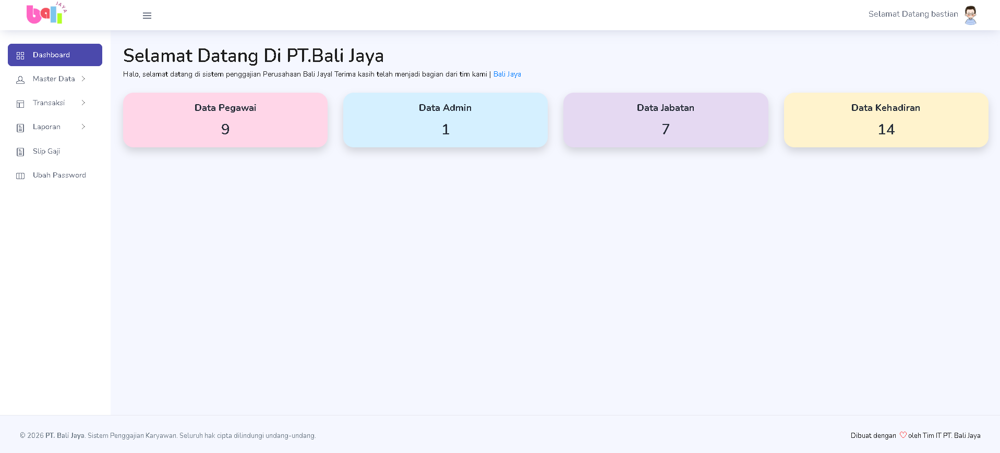
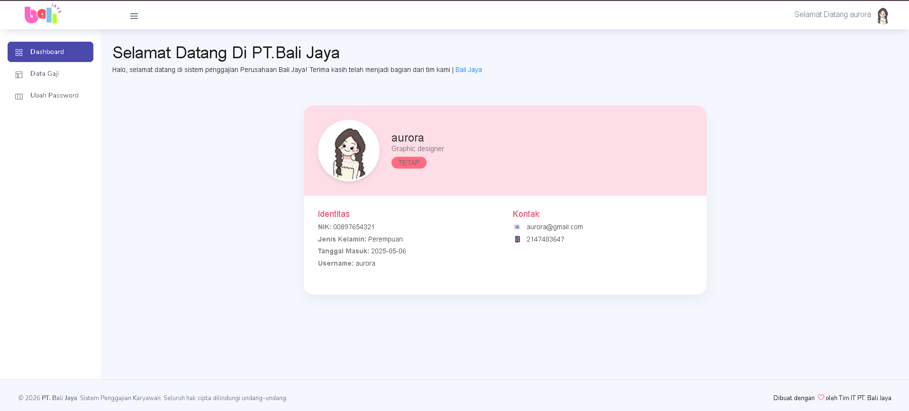

Website Penggajian Pegawai

 Deskripsi
Website Penggajian Pegawai merupakan aplikasi berbasis *CodeIgniter 3* yang dirancang untuk membantu proses pengelolaan data pegawai, absensi, perhitungan gaji, hingga pembuatan laporan secara lebih cepat dan terorganisir.

---

 Fitur Utama
- Login Admin
- Dashboard
- Manajemen Data Admin
- Manajemen Data Pegawai
- Manajemen Jabatan
- Absensi Pegawai
- Perhitungan Gaji Otomatis
- Cetak Slip Gaji
- Laporan Penggajian
- Ubah Password
- Logout

---
Teknologi yang digunakan
- PHP
- CodeIgniter 3
- MySQL
- Bootstrap
- HTML
- CSS
- JavaScript

---

 Cara Menjalankan Project
1. Clone atau download repository ini.
2. Pindahkan project ke folder *htdocs* (XAMPP).
3. Import database yang terdapat pada folder *database*.
4. Atur koneksi database pada file application/config/database.php.
5. Jalankan Apache dan MySQL melalui XAMPP.
6. Buka project melalui browser.

---
Tampilan

### Halaman Admin

### Halaman Pegawai

### Login

### Tampilan lainnya

